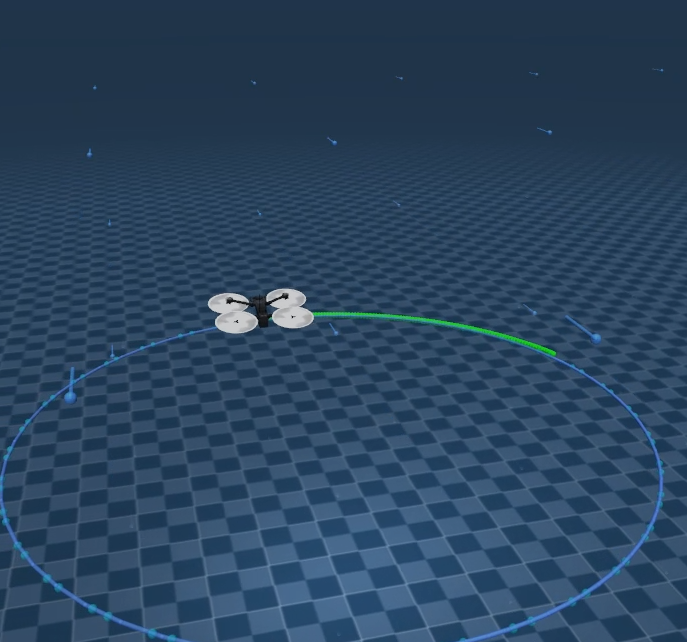

# MuJoCo PINN-MPPI Quadrotor Control

This repository implements a high-performance quadrotor control system in **MuJoCo**, integrating **Physics-Informed Neural Networks (PINN)** with **Model Predictive Path Integral (MPPI)** control. The system is designed to achieve precise trajectory tracking even under challenging conditions like high-velocity wind fields.

-----

## 🚀 Key Features

  * **PINN-MPPI Controller**: Combines a Residual PINN model to predict aerodynamic disturbances with the robust sampling-based MPPI for optimal control.
  * **MuJoCo Physical Simulation**: Features a high-fidelity environment supporting both Hummingbird and Skydio X2 quadrotor models.
  * **Realistic Aerodynamics**: Includes motor dynamics (15ms time constant), aerodynamic drag ($C_{dx}, C_{dy}, C_{dz}$), and torque compensation.
  * **Advanced Visualization**:
      * **MPPI Rollouts**: Visualizes multiple potential future trajectories, color-coded from green (low cost) to red (high cost).
      * **Wind Field**: Dynamic vector field visualization showing wind direction and magnitude.
      * **Error Heatmap**: The flight path changes color based on the real-time tracking error.

## 🛠 Installation & Requirements

Ensure you have the following dependencies installed:

  * `mujoco >= 3.0`
  * `torch` (CUDA recommended for MPPI sampling)
  * `numpy`
  * `rotorpy`

## 💻 Usage

Run the simulation using the following commands:

**1. Standard Circle Trajectory with 8m/s Wind:**

```bash
python simulation/mppi_pinn_mujoco.py --render --traj circle --wind 8
```

**2. Using Skydio X2 Model for Visualization:**

```bash
python simulation/mppi_pinn_mujoco.py --render --skydio --traj circle --wind 8
```

**3. Run Baseline (Nominal MPPI without PINN):**

```bash
python simulation/mppi_pinn_mujoco.py --render --traj circle --wind 8 --no_pinn
```

## 📊 Physical Parameters

The environment is configured with the following physical constants:

| Parameter | Symbol | Value |
| :--- | :--- | :--- |
| Mass | $m$ | **0.5 kg** |
| Thrust Coefficient | $K_{\eta}$ | $5.57 \times 10^{-6}$ |
| Torque Coefficient | $K_{m}$ | $1.36 \times 10^{-7}$ |
| Motor Time Constant | $\tau$ | **15 ms** |
| Hover Rotor Speed | $\omega_{hover}$ | \~662.6 rad/s |

## 📂 Project Structure

  * `mppi_pinn_mujoco.py`: Main entry point for simulation and visualization.
  * `quadrotor_env.py`: MuJoCo environment wrapper handling physics and state.
  * `controllers/pinn_mppi_v2.py`: GPU-accelerated MPPI algorithm implementation.
  * `models/pinn.py`: Architecture for the Residual PINN.

## ⌨️ Controls

  * **Press `C`**: Toggle between **Auto-Follow Camera** and **Free Camera**.
  * **Blue Line**: Expected reference trajectory.
  * **Yellow Sphere**: Current target setpoint.

-----

### Demo


